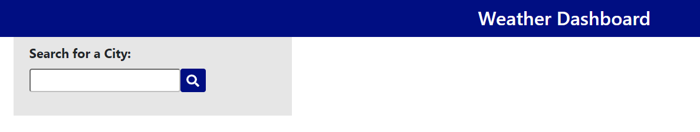
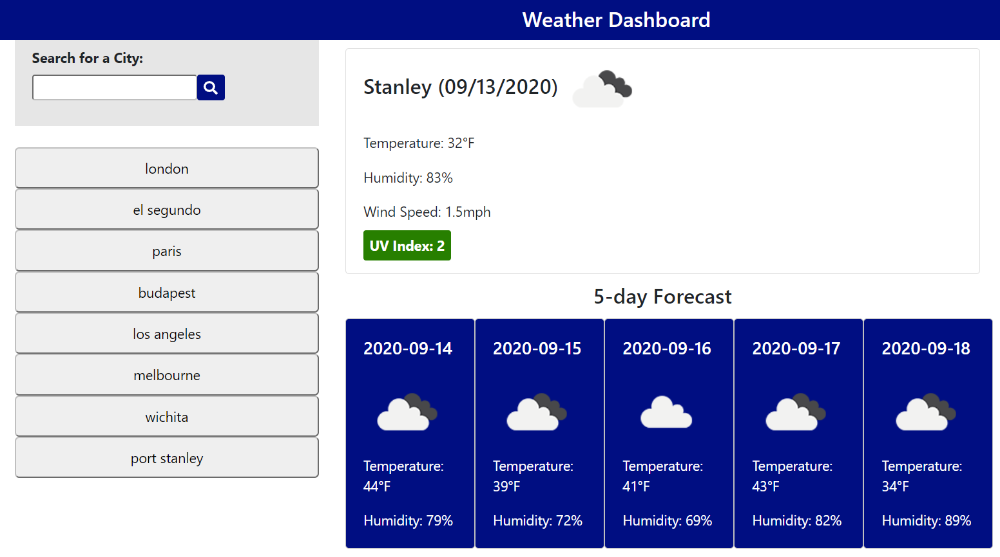

# Week 6 Challenge - Weather Dashboard

## Table of Contents

* [Deployment](#deploy)
* [Description of Challenge](#description)
* [Execution of the Challenge](#execution)
* [Lessons Learned](#lessons)
* [More A-ha in the Future, aka Challenges to Get Over](#challenges)

## Deployment 

* The challenge is deployed at the following live URL:
https://plainjane99.github.io/Weather_Dashboard/

You should see the following at first load of the application:

You should see the following upon use of the application:

* The application code for this challenge is located at the following GitHub repository:
https://github.com/plainjane99/Weather_Dashboard

## Description of Challenge 

The Week 6 Challenge for the UCLA Extension Full Stack Development Bootcamp was to create a "Weather Dashboard" without starter code.  The Weather Dashboard is to allow a user to search by city and have the dashboard display the weather for the current day as well as a 5-day forecast.  The Dashboard is also to display previously searched cities.  The acceptance criteria for this challenge included:  
* The current day is to include the city name, current date, icon of weather condition, temperature, humidity, wind speed, and UV index with a color representing the favorableness of the index.
* The 5-day forecast is to include the date, icon of the weather condition, temperature, and humidity.
* The dashboard is to save previously searched cities in local storage, and display and pull data for previously saved cities.

Once the acceptance criteria were met, the challenge was to be deployed to a live URL through GitHub and to have the webpage load with no errors.  

## Execution of the Challenge/Code 

This was a really fun challenge that tested what I have learned to-date as well as improved my understanding of those concepts that I have been struggling with.  In an attempt to make this README a little more professional, I will outline my personal execution as well as a description of the code itself.

* HTML and Styling - The structure of the HTML and CSS is based on Bootstrap framework as well as vanilla CSS.  The main layout of the webpage is two columns within a row.  The left column contains two sections, the search input form and the search history display area.  The right hand column contains the "today" display area and the 5-day forecast area.  The 5-day forecast area is then split further into columns that hold each one day of the 5-day forecast.  All of this layout was constructed using Bootstrap Grid and Bootstrap Cards.  All additional styling was created in CSS.  

    The HTML and Styling to create the basic layout is starting to become intuitive and easy to execute.  The DevTool is such an excellent tool to try out styling before implementing it into code.  I have really gained an appreciation for the "Elements" tab in the DevTool.

* Javascript - The webpage functionality is written using vanilla Javascript for all functions and event handling as well as the use of the moment.js and font-awesome libraries.

    Manipulation - I choose to use vanilla Javascript for dynamically creating my HTML because I did not have a good handle on it during the Week 4 Module and Challenge.  After writing twelve instances of DOM methods, I believe I now have a decent grasp of how to dynamically create HTML.  

    Functions - Working through this challenge has provided me a much better understanding of how to write Javascript functions.  My tendency is to write one extensive function that does everything, but as I go through the challenge, I realize that one function may need to be broken up into more than one in order to allow the code to use the same functionality without having to complete unncessary steps or so that I am not forced to write the same code over again.  I am especially proud that I was able to incorporate two "for" loops in my code rather than duplicating code.  One "for" loop is used to generate the display for the 5-day forecast.  The second "for" loop is used to generate the buttons that represent the city names stored in local storage.

    Event Handling - Event handling has been a struggle since the beginning and I was not looking forward to the challenge of incorporate listeners for more than one button.  I ran into the exact same issue that I previously did but I had my a-ha moment as I debugged my code for event handling of the search-history buttons.  

## Lessons Learned 

The lessons learned from this challenge are:

1. DOM Manipulation: You may be able to tell from the code that I started out fairly apprehesive about DOM manipulation.  I pre-wrote the HTML and added class attributes to the entirety of the "left-hand" column that contains the Search Form and the Search-History buttons then proceeded to use DOM manipulation to add in the text content only.  However, when I got to the "right-hand" column, I realized I could not get away with pre-writing the HTML because it displayed empty cards on the webpage.  The right-hand functionality required correct use of DOM manipulation and, once forced, I discovered that it was not such a mystery after all.

2. Event Handling: A significant A-ha for me was understanding why my event handling had gone so poorly in the past.  The issue I had was that it seemed a single event handler seemed to be listening to more than what I thought it should be listening to.  I learned, once again, how important it is to specifically add id attributes to html elements because it does provide "meaning" to the elements.  I learned that event listener should be applied to the lowest level that is to be listened, otherwise an event at a higher level in the html will not be specific enough to capture the event.

3. Chrome Developer Tools:  The DevTools continue to amaze me.  I am becoming more and more comfortable at adding styling to the "Elements" tab.  I find the Console tab to be essential to debugging.  I am getting a good grasp of browsing through objects in the "Network" tab to find the exact endpoint I am looking for.  Such an Awesome tool!

## More A-ha in the Future, aka Challenges to Get Over 

The challenges I know I have ahead of me include:
1. Event Handling and DOM Manipulation - I look forward to the next assignment(s) requiring event handling and DOM manipulation to ensure I understand them well.
2. Functions - Functions are becoming easier, but I look forward to not having the anxiety I feel when I decide to break a working function into multiple functions.  :)  

Thanks for reading this README.md.